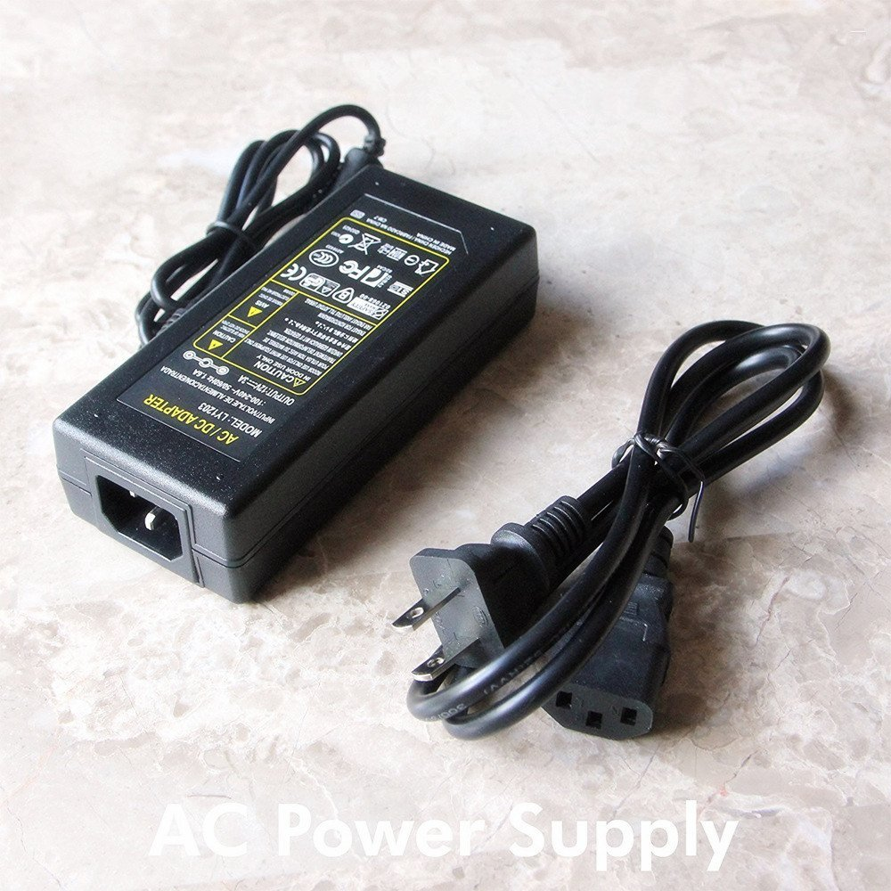
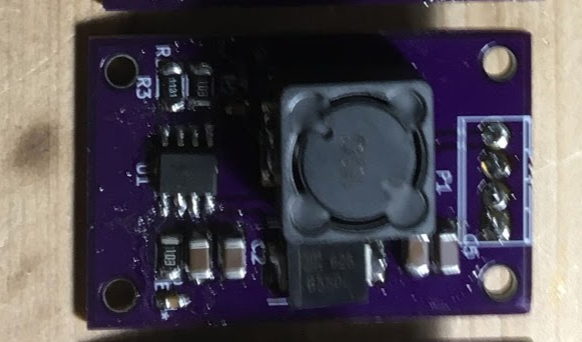
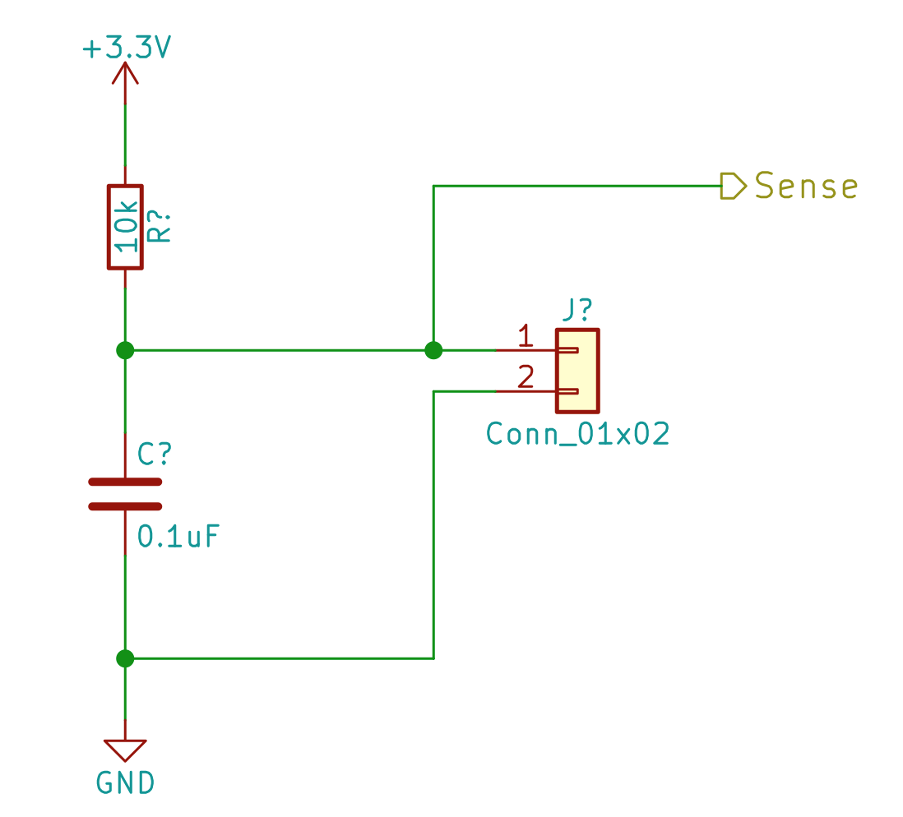
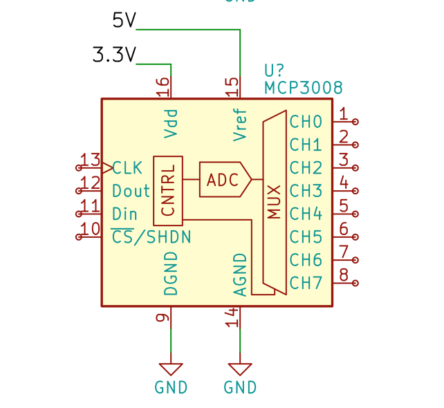
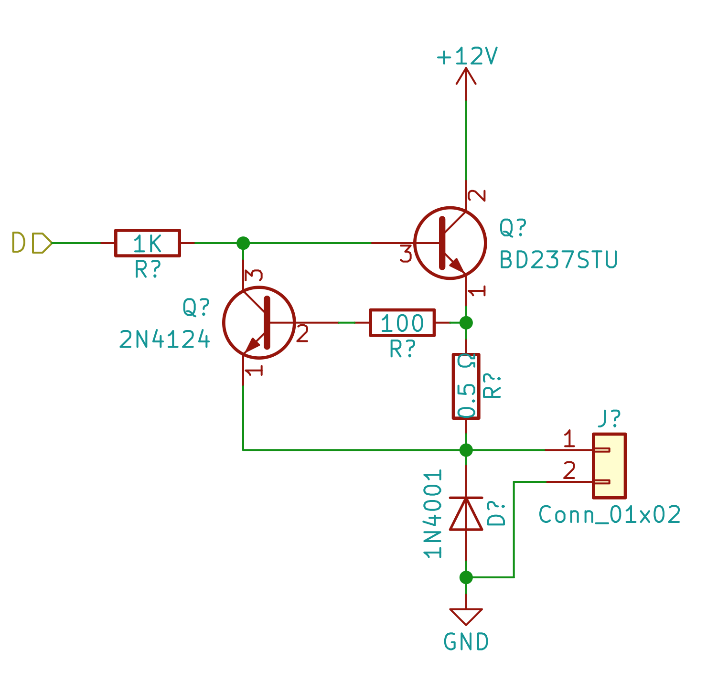
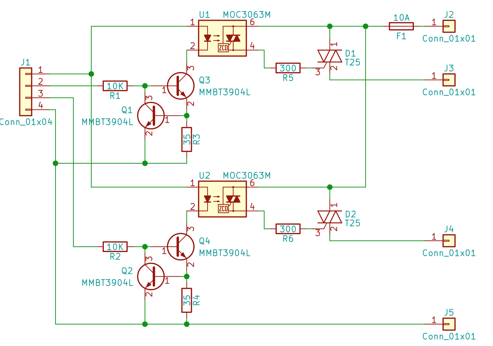
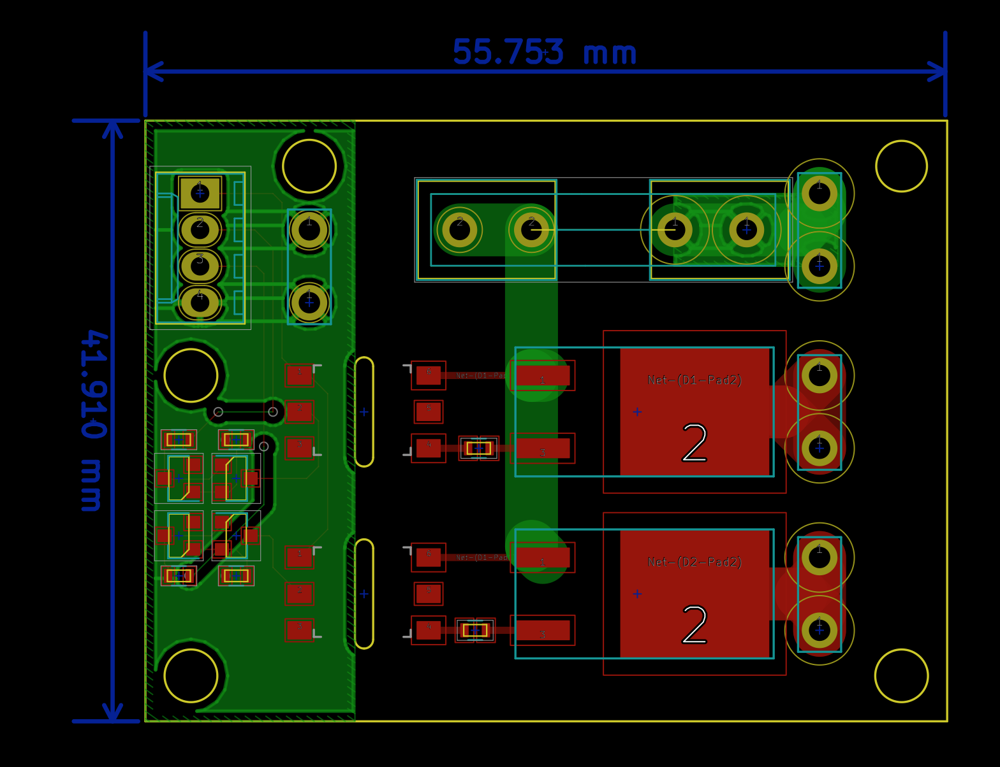
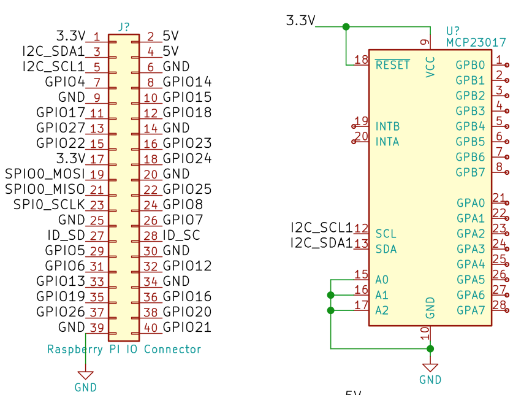

# robot-jardin

A controller to automate watering of an indoor tomato farm.


* Moisture sensors for soil.
* Solenoids to control watering.
* Hoses and T pieces to direct water into the pots.
* A LED light system. Mechanism to turn on and turn off the lights.
* Slack integration to the Raspberry Pi for control and monitoring.

## Requirements

### Platforms

- Raspbian

#### Configuration

##### wifi-interface
```
sudo nano /etc/network/interfaces

auto wlan0
iface wlan0 inet static
  address 192.168.1.180
  netmast 255.255.255.0
  gateway 192.168.1.1
  wpa-conf /etc/wpa_supplicant/wpa_supplicant.conf
```

##### wpa_supplicant
```
sudo nano /etc/wpa_supplicant/wpa_supplicant.conf

country=CA
ctrl_interface=DIR=/var/run/wpa_supplicant GROUP=netdev
update_config=1

network={
    ssid="ssid"
    psk="psk"
}
```

##### Enabling services
```
sudo raspi-config
Interfacing options
Enable ssh
Enable SPI
```
## Packages

Everything runs on Python3

### spidev
```
sudo apt-get install python3-spidev
wget https://github.com/Gadgetoid/py-spidev/archive/master.zip
unzip master.zip
rm master.zip
cd py-spidev-master
sudo python setup.py install
cd ..
```
### Adafruit Python GPIO
```
sudo apt-get update
sudo apt-get install build-essential python-pip python-dev python-smbus git
git clone https://github.com/adafruit/Adafruit_Python_GPIO.git
cd Adafruit_Python_GPIO
sudo python setup.py install
sudo python3 -m pip install git+git://github.com/chrisb2/pi_ina219.git
```
### Adafruit Python MCP3008
```
sudo apt-get update
sudo apt-get install build-essential python-dev python-smbus python-pip
sudo pip3 install adafruit-mcp3008
```
## MISC
https://github.com/stefanwichmann/kelvin

https://www.amazon.ca/Irrigation-System-Sprinkler-Watering-Outdoor/dp/B073NBHRRD/ref=sr_1_8?ie=UTF8&qid=1523198279&sr=8-8&keywords=plant+watering

http://www.davidhunt.ie/water-droplet-photography-with-raspberry-pi/

## Hardware
* To use a piece of proto board, with a Raspberry PI expansion connector.
* Thru-hole components
* A power adapter rated at 12V, 5A (this is more than enough, but commodity available on Amazon).
* A 5V regulator circuit (So we can use the same power brick for powering the PI as well).
* moisture sensors connected to an AD converter.
* water valve solenoid controlled by transistors.
* lights controlled by switching a plug.

Where possible datasheets for the parts we have thought about using are in the doc/datasheets folder.

## Raspberry Pi
We have the Raspberry Pi 3B. We want to use this, for the familiarity of programming language (Python).

Also we wish to have slack integration for remote query, monitoring, and control of the device.

### Power adapter
We needed 12V to drive the solenoid.  The solenoid takes about 100mA of power.  Plus we need to consider the power requirements of the Raspberry Pi.

We found this on Amazon for $12


It sais it is for LED strip lighting. 12V rated at 5A.  This will be more than enough for our uses.

## Voltage Regulator
Rather than needing a 2nd power brick adapter for powering the Raspberry Pi, which is another plug in the power bar, and another cable, and that micro USB power connector that never stays plugged in nicely (compared to a barrel jack power connector), it would be better if we could power the Raspberry Pi from our power adapter.

Several sites recommend that you use the USB input, because the Pi has built in power protection for you, so that if you accidentally give it more than 5V input you won't wreck you Pi.

Here, if we use a good 5V stable voltage regulator, then we should not have any problems with our Pi. Unless we drop the Pi into a bucket of water. But really that will have more problems than electrical power input considerations.



This was from a different project where I was going to use this to drive some stepper motors. It should have enough power to handle the Pi.

### Moisture Sensor Inputs
These moisture sensors came with a small intermediate circuit board. This module has a comparator on it, so that it can produce a digial output. Our initial experiments found this to be not very reliable or accurate, or consistent. Turning that little potentiometer is hard to get it to where we want. And also, what does it mean. It does not leave room for adjustments in software. The board also has an analog output. But really this is just using a resistor to create a voltage divider type of circuit across the probe input. We have chosen to use this analog mode of the sensor.  So instead of needing to use this little circuit board it would be better if we just built the components onto our own circuit board. This way we can have just a pair of wires from the circuit board to the moisture sensor.

We analyzed the circuit board and it contains these components.



Where the connector can be one of those screw terminal PCB mount connectors.  The wires we can use to go to the probe can be one of the pairs from a regular cat5 network cable type twisted pair wire, and then as long as we need to reach the potted plants from where the sensor is installed.

The sense goes straight into our analog to digital converter (currently the MCP3008 device).

When the soil is dry, the output will be a higher voltage. As the soil gets more moist, the probes will have a lower resistance, and thus create a lower voltage to the ADC.

Here we have chosen to use 3.3V as analog the input to the probes, since this is what the IO pins to the Raspberry Pi will use. The MCP3008 Supports separate Analog reference, but only as long as this is less than or equal to the VDD input.  Using 5V might possibly give us a better details when considering the small resistance that will be added from length of the wires to the probes. And 5V also lets us use faster samples. But really we are only going to be reading a few times a minute (or otherwise very low sample rate here).

#### One thing to note: Minimun dryness Threshold in software.

We should calibrate our software to expect the soil has a minimum dryness.  In that if the soil is below this threshold value then we do not attempt to try to water the soil. (e.g. we have a reading less than the maximum voltage possible).

This is because we have no way to differentiate between really dry soil, and if the probes are entirely not connected at all. such as there is no wires hooked up to the Raspberry Pi.  or in a more likely real world use case, if the wires on the probe corroded or the probe corroded or is no longer working.

In this situation (probes disconnected), when the soil appears dry to us, if we turn on the solenoid to let water in, the soil will never actually give a reading of "not dry" (because the probes are broken or disconnected). And we end up flooding the plants, and possibly making a mess of the apartment.

The proposal here then is to require the soil be some what moist. (e.g. so we are able to read a slightly lower voltage than just the max voltage). And then work with adjusting the soil moisture to be more moist within this. Assuming of course that we are able to read a minimum moisture that is within the range of what we would want the plants to be.

### Analog to digital controller
As discussed earlier, it is preferred we read the moisture sensor analog output, instead of its digital output, as our testing found there is not a very meaningful output from the moisture sensor digital output. Other than it is amusing for a test circuit on a breadboard.

The Raspberry Pi has no analog inputs. So we need something that can provide us with analog to digital conversion. For this we have selected the MCP3008 device.


This is because this is a popular and inexpensive device, that is available in a 16-dip package, and has a good community supported driver.

It also has 8 channels. So we can readily connect up to 8 analog inputs. Such as moisture sensors, or anything that can provide us a voltage , like ambient light sensors, noise sensors, pressure sensors, potentiometers, etc.

Our immediate use will be a few moisture sensors.

### Solenoid Driver
We can use a basic digital IO pin from the Raspberry Pi to drive a solenoid.  The solenoid we have choosen works around 12V and uses about 100mA of current. A simple transistor driver circuit is good enough for this.

But we thought there should be some short circuit protection, in case we short out the wires to the solenoid, or the solenoid becomes connected to ground. This circuit below attempts to provide this protection.



The input from the Raspberry Pi digital IO pin of logic level HIGH will turn on the solenoid.  I prefer this option from the usual Ali express type of relay board. Where they have the opto isolators and relays, which can be used for anything from 12 VDC to 120 VAC. But they are active low inputs. Which means when you power on the Pi and the GPIO pins are logic level LOW by default, this will turn on the relays until our software boots up and asserts logic level HIGH to the pin.

Practically these relay boards do this to allow for more general compatibility with microcontrollers. Most semiconductor devices are able to sink more current (pull a pin low) then they are able to source current (pull a pin high). Here this is a mute point since we are using a transitor driver which uses much less current than the opto isolators (about 20 mA) on a relay board.

The 12V power for the solenoid will be provided by the power supply brick above.

### Plug Driver
To control the lighting for the plants we assume something that can handle being powered on and off by unplugging it. Such as a lamp with a switch that can be turned on and have the lamp come on when it is plugged in.

We have thought about using relays, but really it is more elegant to use Triac device with an opto isolator. This is the same feature and behavior as a solid state relay, only not as expensive. Here we are assuming we ae not using heavily inductive loads and thus do not require power conditioning or snubbering (beyond what the Trac provides).

Using these STMicroelectronics Snubberless series Triacs.


We have a connector there for AC ground to be also our ground.

This is actually two swiches. The idea being that in a standard duplex plug there are two halves (top and bottom). So that we can provide individual switching to each half. Which will allow us to plug two lights into a single duplex plug.

The board can be laid out small enough to fit inside a metal duplex outlet style box. So that we can provide control wires into the box.
I was invisioning an extension cord with the metal plug box on the end with this controller board inside the metal box.


This keeps all of the 120V AC inside the extension cord and outlet box. We do not need to have 120V wires going out of the box to our circuit board. Which is a good thing here, since we are working with both water and electricity.

So to use this we will just need 2 digital IO pins from the Pi.

## IO expander

If we will have a lot of digital IO pins, such as to drive the solenoids and plug drivers, then it is recommended we look into a port expander.

A device such as the MPC32017 will do this well


here it requires (2) GPIO pins from the Raspberry Pi (the I2C bus pins) and provides us 16 pins, which can individually be configured as inputs or outputs.

If we were using them as digital inputs, then we would need some another GPIO pins for connecting those INTA, INTB pins. Which are for notifying the Raspberry Pi there is a pin state change on an input pin.

## Other Considerations

The site where this is installed should have a ground fault circuit interrupt (GFCI) type outlet installed into the wall.

This is where we will plug in
* The power adapter for powering the Raspberry Pi and solenoids and controlling the lights.
* The controlled plug for the lighting for the plants.

This is because we are working with water here.  According to Canadian buliding code, electrical applicances used near water, such as in a bathroom or kitchen, should be serviced from a GFCI outlet.

It is also beyond the scope of this project to instruct how to obtain and install a GFCI outlet. Consult your local electrician or home improvement store.
