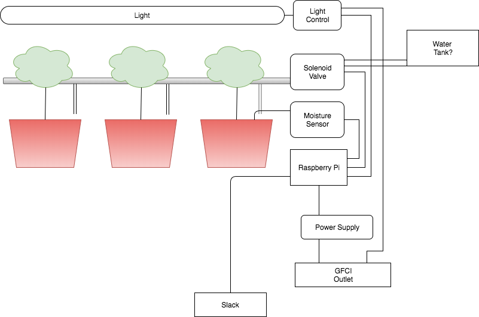

# robot-jardin

A controller to automate watering of an door tomato farm.



* Moisture sensors for soil.
* Solenoids to control watering.
* Hoses and T pieces to direct water into the pots.
* A LED light system. Mechanism to turn on and turn off the lights.

## Requirements

### Platforms

- Raspbian

#### Configuration

##### wifi-interface
```
sudo nano /etc/network/interfaces

auto wlan0
iface wlan0 inet static
  address 192.168.1.180
  netmast 255.255.255.0
  gateway 192.168.1.1
  wpa-conf /etc/wpa_supplicant/wpa_supplicant.conf
```

##### wpa_supplicant
```
sudo nano /etc/wpa_supplicant/wpa_supplicant.conf

country=CA
ctrl_interface=DIR=/var/run/wpa_supplicant GROUP=netdev
update_config=1

network={
    ssid="ssid"
    psk="psk"
}
```

##### Enabling services
```
sudo raspi-config
Interfacing options
Enable ssh
Enable SPI
```
## Packages

Everything runs on Python3

### spidev
```
sudo apt-get install python3-spidev
wget https://github.com/Gadgetoid/py-spidev/archive/master.zip
unzip master.zip
rm master.zip
cd py-spidev-master
sudo python setup.py install
cd ..
```
### Adafruit Python GPIO
```
sudo apt-get update
sudo apt-get install build-essential python-pip python-dev python-smbus git
git clone https://github.com/adafruit/Adafruit_Python_GPIO.git
cd Adafruit_Python_GPIO
sudo python setup.py install
sudo python3 -m pip install git+git://github.com/chrisb2/pi_ina219.git
```
### Adafruit Python MCP3008
```
sudo apt-get update
sudo apt-get install build-essential python-dev python-smbus python-pip
sudo pip3 install adafruit-mcp3008
```
## MISC
https://github.com/stefanwichmann/kelvin

https://www.amazon.ca/Irrigation-System-Sprinkler-Watering-Outdoor/dp/B073NBHRRD/ref=sr_1_8?ie=UTF8&qid=1523198279&sr=8-8&keywords=plant+watering

http://www.davidhunt.ie/water-droplet-photography-with-raspberry-pi/
